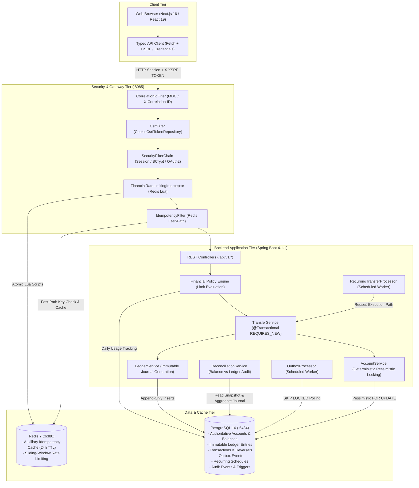
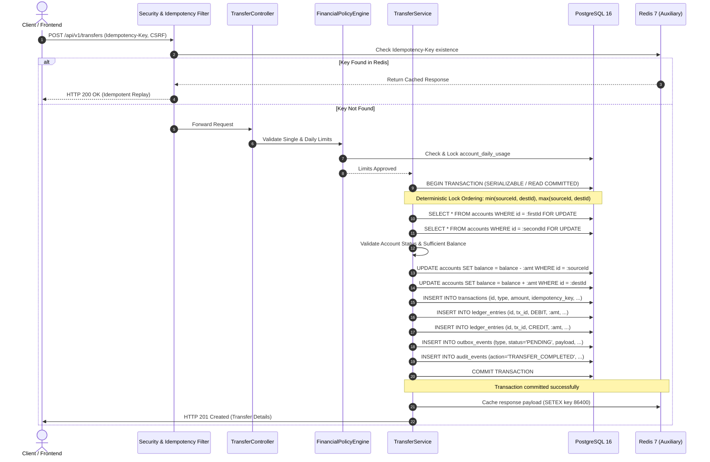
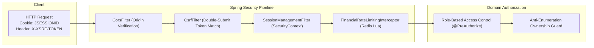

# Financial Ledger Engine

[](https://openjdk.org/)
[](https://spring.io/projects/spring-boot)
[](https://www.postgresql.org/)
[](https://redis.io/)
[](https://nextjs.org/)
[](https://react.dev/)
[](https://www.typescriptlang.org/)
[](https://tailwindcss.com/)
[](https://jmeter.apache.org/)
[]()
[](https://opensource.org/licenses/MIT)

A portfolio-grade financial ledger engine engineered with double-entry accounting, strict ACID transactional consistency, deterministic pessimistic concurrency control, authoritative PostgreSQL ledgering, auxiliary Redis idempotency and sliding-window rate limiting, transactional outbox event publishing, scheduled recurring transfers, and automated balance-to-ledger reconciliation.

---

## Table of Contents

- [Overview & Problem Statement](#overview--problem-statement)
- [Core Financial Guarantees & Invariants](#core-financial-guarantees--invariants)
- [UI Modules & Interface Walkthrough](#ui-modules--interface-walkthrough)
- [Key Features](#key-features)
- [System Architecture](#system-architecture)
- [Financial Transaction Lifecycle](#financial-transaction-lifecycle)
- [Concurrency & Deadlock Prevention](#concurrency--deadlock-prevention)
- [Idempotency Architecture](#idempotency-architecture)
- [Reconciliation & Invariant Auditing](#reconciliation--invariant-auditing)
- [Transactional Outbox Pattern](#transactional-outbox-pattern)
- [Recurring Transfers Engine](#recurring-transfers-engine)
- [Security Architecture](#security-architecture)
- [Observability & Structured Diagnostics](#observability--structured-diagnostics)
- [Technology Stack](#technology-stack)
- [Project Structure](#project-structure)
- [Complete API Reference](#complete-api-reference)
- [Database Schema & Migrations](#database-schema--migrations)
- [Local Development Guide](#local-development-guide)
- [Environment Variables](#environment-variables)
- [Docker Infrastructure](#docker-infrastructure)
- [Testing Suite](#testing-suite)
- [CI/CD & GitHub Actions](#cicd--github-actions)
- [Performance Benchmarks & Load Testing](#performance-benchmarks--load-testing)
- [Production Readiness Considerations](#production-readiness-considerations)
- [Troubleshooting & Operational Runbook](#troubleshooting--operational-runbook)
- [Roadmap](#roadmap)
- [Contributing](#contributing)
- [License & Author](#license--author)

---

## Overview & Problem Statement

Financial software cannot rely on naive balance updates such as `UPDATE accounts SET balance = balance - :amount`. In high-concurrency environments, such patterns introduce catastrophic edge cases:

- **Lost Updates & Phantom Balances**: Interleaved read-modify-write operations overwrite concurrent balance changes without detection.
- **Negative Balances**: Race conditions allow concurrent withdrawals to bypass application-level balance validations.
- **Deadlocks**: Concurrent multi-account transfers locking accounts in opposite orders create circular dependency cycles, aborting transactions.
- **Auditing Blindness**: Mutating balances in-place without an immutable double-entry journal destroys the historical audit trail.
- **Dual-Write Inconsistencies**: Updating database state while publishing to message brokers leads to silent divergence when network or database failures occur.
- **Duplicate Processing**: Network timeouts induce client retries that execute the same payment multiple times.

The **Financial Ledger Engine** solves these challenges by treating the double-entry ledger as the sole authoritative truth. Account balances are cached snapshot projections; the immutable double-entry journal represents the historical financial reality. All mutations execute within atomic PostgreSQL transactions using row-level pessimistic locks ordered deterministically to eliminate deadlocks. Redis is deployed strictly as an auxiliary tier for rate limiting and fast-path idempotency caching, ensuring zero financial state is ever lost if Redis restarts.

### Architectural Principles

1. **PostgreSQL is the Authoritative Financial Source of Truth**: All balances, transactions, ledger entries, policy limits, outbox events, and recurring schedules reside in PostgreSQL.
2. **Redis is Auxiliary Only**: Redis provides sub-millisecond idempotency deduplication and sliding-window rate limiting. Redis loss never causes financial inconsistency.
3. **Double-Entry Accounting Invariant**: Every transfer creates balanced `DEBIT` and `CREDIT` entries referencing the parent transaction. Total debits must equal total credits ($\sum \text{debits} - \sum \text{credits} = 0$).
4. **Ledger Immutability**: Database triggers block `UPDATE` and `DELETE` queries on ledger records. Errors are corrected exclusively through compensating reversal transactions.
5. **Deterministic Concurrency Control**: Accounts are locked in deterministic lexicographical order (`min(id, dest)` then `max(id, dest)`), converting multi-account contention graphs into directed acyclic graphs (DAGs).
6. **Platform Currency Enforcement**: Strictly single-currency (`INR`), backed by domain rules and PostgreSQL `CHECK` constraints across all balance and amount fields.
7. **No Floating-Point Arithmetic**: Java `BigDecimal` and PostgreSQL `NUMERIC(19,4)` are used exclusively throughout the entire system.
8. **Transactional Outbox for Event Publishing**: State mutations and outbox records commit in the same database transaction, eliminating dual-write anomalies.
9. **Scheduling Metadata vs. Execution Engine**: Recurring transfers represent scheduling metadata only; execution routes through the battle-tested financial transfer engine.

---

## Core Financial Guarantees & Invariants

| Invariant / Guarantee | Enforcement Layer | Implementation Mechanism |
|---|---|---|
| **Authoritative Source of Truth** | Database Engine | PostgreSQL 16 stores all financial state; Redis holds no financial data. |
| **Strict Single Currency (`INR`)** | Database & Domain | CHECK constraints `chk_accounts_currency_inr`, `chk_transactions_currency_inr`, `chk_ledger_entries_currency_inr`. |
| **Zero-Sum Double Entry** | Database & Domain | Atomic generation of paired `DEBIT` and `CREDIT` entries. $\sum \text{Debits} = \sum \text{Credits}$. |
| **Ledger Immutability** | Database Trigger | PostgreSQL trigger `trg_prevent_ledger_mutation` disallows `UPDATE` and `DELETE` on `ledger_entries`. |
| **Pessimistic Concurrency** | Storage Engine | `SELECT ... FOR UPDATE` row-level locks prevent dirty reads, phantom reads, and lost updates. |
| **Deadlock Elimination** | Domain Application | Deterministic lexicographical account lock sorting by UUID: `min(id, dest)` followed by `max(id, dest)`. |
| **Non-Negative Balances** | Database Constraint | `chk_accounts_balance_non_negative` enforces `balance >= 0.0000` at the storage layer. |
| **Authoritative Idempotency** | Database Index | Unique constraint `uk_transactions_idempotency_key` guarantees retries never double-post. |
| **Reversibility via Compensation** | Domain & Ledger | Original transactions remain unmodified; reversals generate compensating double-entry journals. |
| **Audit Log Immutability** | Database Trigger | PostgreSQL trigger `trg_prevent_audit_event_mutation` enforces append-only operational audit logging. |
| **Zero Dual-Write Race Conditions** | Outbox Pattern | Outbox events written in the same transaction as financial mutations; polled with `FOR UPDATE SKIP LOCKED`. |
| **System Treasury Backing** | System Seed Data | Platform bootstrap (`10,000,000 INR`) and opening balances originate from auditable `SYSTEM_CLEARING` accounts. |

---

## UI Modules & Interface Walkthrough

The administrative and customer frontend is built using Next.js 16 (App Router), React 19, TypeScript, and Tailwind CSS 4. It interfaces with the Spring Boot backend using cookie-based session authentication (`JSESSIONID`) and double-submit CSRF headers (`X-XSRF-TOKEN`).

| Module | Route | Primary Capabilities | Technical Highlights |
|---|---|---|---|
| **Executive Dashboard** | `/app` | Real-time aggregate balances, recent ledger journal, quick transfer triggers | Optimistic query caching with TanStack Query; responsive layout shell |
| **Account Portfolio** | `/app/accounts` | Multi-account overview, lifecycle state (`ACTIVE`, `SUSPENDED`, `FROZEN`, `CLOSED`) | Create account modal, zero-balance closure enforcement, limits view |
| **P2P Transfer Studio** | `/app/transfers` | Direct double-entry account-to-account transfers with live fee/limit validation | Multi-step workflow: input $\rightarrow$ preview $\rightarrow$ execution with UUID idempotency |
| **Deposits & Withdrawals** | `/app/transfers` | External clearing deposits and withdrawals against `SYSTEM_CLEARING` | Real-time daily policy limit checking; error boundary handling |
| **Recurring Transfers** | `/app/recurring-transfers` | Create, pause, resume, cancel scheduled recurring payments; audit executions | Modal execution history inspection; status badges (`ACTIVE`, `PAUSED`, etc.) |
| **Immutable Ledger Journal** | `/app/ledger` | Chronological multi-account double-entry transaction and ledger browser | Monospace amount formatting, debit/credit badges, sequence numbers |
| **Reconciliation Audit** | `/app/reconciliation` | Automated balance-to-ledger audit across all accounts with discrepancy detection | Drill-down modal comparing snapshot balances to journal calculations |
| **Operational Audit Trail** | `/app/audit` | Comprehensive security and administrative audit log viewer | Filter by event type, actor, IP address, and date window |
| **Financial Analytics** | `/app/analytics` | Transfer volume mix, debit/credit distributions, daily volume trends | Interactive Recharts visualizations with responsive card wrappers |
| **Settings & Security** | `/app/settings` | Password management, session overview, theme selection (Dark/Light) | Reactive form validation via Zod and React Hook Form |

> [!NOTE]
> The Next.js frontend is located under `frontend/` and runs on port `3001` during local development (`npm run dev -- -p 3001`), connecting to the Spring Boot REST API on port `8085`.

---

## Key Features

### 1. Double-Entry Accounting Engine
- **Balanced Journaling**: Every financial mutation writes paired ledger entries. A transfer of $X$ from Account A to Account B creates a `DEBIT` entry of $X$ on Account A and a `CREDIT` entry of $X$ on Account B.
- **Database Immutability**: PostgreSQL trigger `trg_prevent_ledger_mutation` rejects any `UPDATE` or `DELETE` on `ledger_entries`, rendering ledger history cryptographically tamper-evident.
- **Fixed Monetary Precision**: All balances and transaction amounts use Java `BigDecimal` and PostgreSQL `NUMERIC(19,4)`. Floating-point arithmetic is strictly rejected across all domain models and DTOs.

### 2. Atomic Financial Mutations
- **Transfers (`/api/v1/transfers`)**: Atomically moves funds between accounts with deterministic locking, policy evaluation, outbox publishing, and audit logging.
- **Deposits (`/api/v1/deposits`)**: Credits an active checking account by debiting the platform's `SYSTEM_CLEARING` account.
- **Withdrawals (`/api/v1/withdrawals`)**: Debits an active checking account and credits `SYSTEM_CLEARING`, enforcing non-negative balance constraints.
- **Reversals (`/api/v1/transfers/{id}/reverse`)**: Generates compensating mirror ledger entries without rewriting historical transactions. Protected by partial unique index `idx_reversals_unique_active` to prevent double reversals.

### 3. Concurrency Safety & Deadlock Prevention
- **Pessimistic Row-Level Locking**: Acquires exclusive row locks (`SELECT ... FOR UPDATE`) on account records inside PostgreSQL transactions.
- **Deterministic Lock Ordering**: Sorts account IDs lexicographically before acquiring locks. Regardless of whether Transfer 1 is A $\rightarrow$ B and Transfer 2 is B $\rightarrow$ A, both lock `min(A, B)` followed by `max(A, B)`, mathematically eliminating deadlock cycles.

### 4. Dual-Tier Idempotency Architecture
- **Fast-Path Redis Cache**: Mutating endpoints require an `Idempotency-Key` header. Requests check Redis for cached responses (24-hour TTL) before executing database logic.
- **Authoritative Database Protection**: Backed by a unique database constraint (`uk_transactions_idempotency_key`). Concurrent requests with identical keys are safely caught by database uniqueness, preventing double-posting even during Redis failover.

### 5. Multi-Tier Financial Policy Engine
- **Configurable Limits**: Evaluates single-transaction limits and rolling 24-hour daily aggregate limits (`DAILY_TRANSFER_VOLUME`, `SINGLE_TRANSFER_MAX`).
- **Scoping Hierarchy**: Supports `GLOBAL` defaults, `TIER` policies (`STANDARD`, `PREMIUM`, `VIP`), and granular `ACCOUNT`-level overrides.
- **Atomic Usage Tracking**: Daily usage is tracked in `account_daily_usage` with optimistic/pessimistic update guards, preventing race conditions during rapid transaction bursts.

### 6. Automated Balance-to-Ledger Reconciliation
- **Independent Audit Engine**: Calculates ledger-derived balances by aggregating immutable ledger entries:
  $$\text{Calculated Balance} = \text{Opening Balance} + \sum \text{Credits} - \sum \text{Debits}$$
- **Zero Drift Invariant**: Compares calculated balances against snapshot balances in `accounts.balance`. Discrepancies are flagged immediately via `/api/v1/reconciliation`.

### 7. Transactional Outbox Pattern
- **Atomic Event Publishing**: Financial mutations and outbox events (`TRANSFER_COMPLETED`, `DEPOSIT_COMPLETED`, etc.) are written within the same database transaction.
- **Conflict-Free Polling**: An asynchronous scheduled worker polls pending events using `SELECT ... FOR UPDATE SKIP LOCKED`, allowing concurrent processing without worker contention.
- **Exponential Backoff**: Failed event deliveries retry with configurable exponential backoff and jitter (`base-delay: 2s`, `max-delay: 300s`, `max-attempts: 5`).

### 8. Scheduled Recurring Transfers
- **Scheduling Metadata Model**: Recurring schedules (`recurring_transfers`) store frequency (`DAILY`, `WEEKLY`, `MONTHLY`), execution windows, and status (`ACTIVE`, `PAUSED`, `CANCELLED`).
- **Unified Financial Execution**: Executes recurring transfers by invoking the primary `TransferService.executeTransfer(...)` method under `Propagation.REQUIRES_NEW`, guaranteeing consistent policy and ledger enforcement.
- **Deterministic Idempotency Identity**: Each execution generates an idempotency key derived deterministically from the schedule ID and scheduled execution slot, guaranteeing crash-window idempotency.

### 9. Defense-in-Depth Security
- **Stateful Cookie Sessions**: Employs Spring Security session management (`JSESSIONID`) configured with `HttpOnly`, `SameSite=Lax`, and configurable `Secure` flags.
- **CSRF Token Validation**: Uses double-submit cookie CSRF protection (`XSRF-TOKEN` cookie matching `X-XSRF-TOKEN` header).
- **Anti-Enumeration 404s**: Cross-user unauthorized account access returns HTTP 404 (Not Found) instead of HTTP 403 (Forbidden) to prevent account existence probing.
- **Distributed Rate Limiting**: Redis-backed atomic Lua scripts enforce sliding-window rate limits on authentication (5/min), registration (10/min), and financial mutations (100/min).

---

## System Architecture



---

## Financial Transaction Lifecycle

The sequence below illustrates the complete execution path for a peer-to-peer transfer (`POST /api/v1/transfers`):



---

## Concurrency & Deadlock Prevention

### The Race Condition Problem

In a concurrent financial system, multiple transactions attempting to debit or credit the same accounts simultaneously can result in deadlocks if lock acquisition order is arbitrary:

```text
Thread 1 (Transfer A -> B):  Locks Account A  ──>  Requests lock on Account B (WAITS)
Thread 2 (Transfer B -> A):  Locks Account B  ──>  Requests lock on Account A (WAITS)
Result: DEADLOCK (PostgreSQL aborts one transaction)
```

### Deterministic Lock Ordering Proof

The Financial Ledger Engine eliminates this condition by sorting account identifiers lexicographically prior to lock acquisition. Regardless of whether a transaction transfers funds from Account A to Account B or from Account B to Account A:

$$\text{First Lock Target} = \min(\text{UUID}_A, \text{UUID}_B)$$
$$\text{Second Lock Target} = \max(\text{UUID}_A, \text{UUID}_B)$$

Because all concurrent threads acquire locks in the exact same global order, circular wait conditions cannot form. The contention graph is strictly directed and acyclic:

```text
Thread 1 (Transfer A -> B):  Locks min(A, B) = A  ──>  Locks max(A, B) = B  ──>  Executes & Commits
Thread 2 (Transfer B -> A):  Attempts lock on min(B, A) = A (Blocks until Thread 1 commits)
Result: Zero deadlocks; deterministic sequential queuing.
```

---

## Idempotency Architecture

The platform combines an auxiliary Redis fast-path with authoritative database constraints to guarantee exactly-once processing semantics for financial mutations.

```text
Incoming Request (Idempotency-Key: K)
          │
          ▼
   Check Redis Cache?
     ├─── YES ───► Return Cached HTTP Response (Fast-Path)
     │
     └─── NO  ───► Acquire Redis In-Flight Lock (TTL 60s)
                     │
                     ▼
          Execute Database Transaction
                     │
          INSERT INTO transactions (idempotency_key = K)
                     │
           Database Unique Constraint Violation?
             ├─── YES ───► Abort & Fetch Committed Transaction from DB
             │
             └─── NO  ───► Commit Transaction
                             │
                             ▼
                   Cache Response in Redis (TTL 24h)
                   Release In-Flight Lock
                   Return HTTP 201 Created
```

### Idempotency Comparison

| Dimension | Redis Tier (Auxiliary) | PostgreSQL Tier (Authoritative) |
|---|---|---|
| **Role** | Low-latency response cache & in-flight de-duplication | Final, crash-resilient uniqueness enforcement |
| **Storage Structure** | Key-value string with 24-hour expiration (`SETEX`) | Unique B-tree index `uk_transactions_idempotency_key` |
| **Response Latency** | $< 2\text{ ms}$ | $5 - 15\text{ ms}$ (full ACID roundtrip) |
| **Failure Behavior** | Cache miss falls through to database | Prevents duplicate insertion at storage layer |
| **Data Durability** | Volatile in-memory | Synchronously flushed to WAL disk storage |

---

## Reconciliation & Invariant Auditing

Financial data integrity requires that account balance snapshots continuously reflect the sum of all historic double-entry ledger entries.

### The Double-Entry Balance Equation

For any given account $A$:

$$\text{Balance}_A = \text{OpeningBalance}_A + \sum_{e \in \text{Credits}_A} \text{Amount}_e - \sum_{e \in \text{Debits}_A} \text{Amount}_e$$

The automated reconciliation engine (`ReconciliationService`) executes balance audits by issuing an aggregated SQL audit query across the immutable ledger:

```sql
SELECT 
    a.id AS account_id,
    a.balance AS snapshot_balance,
    COALESCE(SUM(CASE WHEN le.entry_type = 'CREDIT' THEN le.amount ELSE -le.amount END), 0) AS calculated_balance,
    (a.balance - COALESCE(SUM(CASE WHEN le.entry_type = 'CREDIT' THEN le.amount ELSE -le.amount END), 0)) AS difference
FROM accounts a
LEFT JOIN ledger_entries le ON a.id = le.account_id
GROUP BY a.id, a.balance;
```

Any account exhibiting a `difference != 0.0000` is immediately flagged with status `DISCREPANCY_DETECTED`, providing precise ledger offset details for operational investigation.

---

## Transactional Outbox Pattern

To prevent dual-write vulnerabilities between database updates and external event distribution, state mutations and outbox records are written atomically inside a single PostgreSQL transaction.

```text
┌────────────────────────────────────────────────────────┐
│               PostgreSQL ACID Transaction              │
│  - UPDATE accounts                                     │
│  - INSERT INTO transactions                            │
│  - INSERT INTO ledger_entries                          │
│  - INSERT INTO outbox_events (status = 'PENDING')      │
└───────────────────────────┬────────────────────────────┘
                            │ (Committed atomically)
                            ▼
┌────────────────────────────────────────────────────────┐
│             Outbox Polling Worker Process              │
│  SELECT * FROM outbox_events                           │
│  WHERE status = 'PENDING' AND next_retry_at <= NOW()   │
│  ORDER BY created_at ASC                               │
│  LIMIT 20                                              │
│  FOR UPDATE SKIP LOCKED;                               │
└───────────────────────────┬────────────────────────────┘
                            │
               Dispatch to Event Consumer / Bus
             ├─── SUCCESS ───► UPDATE status = 'PROCESSED'
             │
             └─── FAILURE ───► UPDATE retry_count = retry_count + 1,
                               UPDATE next_retry_at = NOW() + backoff,
                               UPDATE status = 'FAILED' (if max attempts exceeded)
```

- **`FOR UPDATE SKIP LOCKED`**: Multiple worker threads or nodes consume outbox events concurrently without row-locking deadlocks or duplicate event pickup.
- **Exponential Backoff**: Transient downstream errors back off exponentially:
  $$\text{Delay} = \min(\text{maxDelay}, \text{baseDelay} \times 2^{\text{attempt}})$$
- **Committed-Only Metrics**: Outbox metrics (`outbox.events.processed`, `outbox.events.failed`) register Spring `TransactionSynchronization.afterCommit()` callbacks to ensure metrics reflect persistent state transitions.

---

## Recurring Transfers Engine

A recurring transfer represents **scheduling metadata**, not a separate execution engine. Every scheduled payment executes through the core `TransferService.executeTransfer(...)` method.

```text
┌────────────────────────────────────────────────────────┐
│            Outer Transaction (Recurring Engine)        │
│  1. Lock due recurring schedule:                       │
│     SELECT * FROM recurring_transfers                  │
│     WHERE status = 'ACTIVE' AND next_execution_at <= NOW()
│     FOR UPDATE SKIP LOCKED;                            │
│                                                        │
│  2. Generate deterministic execution key:              │
│     REC_TX_{scheduleId}_{scheduledSlotIso}             │
└───────────────────────────┬────────────────────────────┘
                            │
                            ▼
┌────────────────────────────────────────────────────────┐
│       Inner Transaction (REQUIRES_NEW Financial Path)  │
│  TransferService.executeTransfer(...)                  │
│  - Evaluates financial policies                        │
│  - Deterministic account locks                         │
│  - Balances updated, ledger entries & outbox written   │
│  - COMMITS INDEPENDENTLY                               │
└───────────────────────────┬────────────────────────────┘
                            │
                            ▼
┌────────────────────────────────────────────────────────┐
│            Outer Transaction (Completion Record)       │
│  3. Record entry in recurring_transfer_executions      │
│  4. Advance next_execution_at to next scheduled slot   │
│  5. Commit outer schedule transaction                  │
└────────────────────────────────────────────────────────┘
```

- **Crash-Window Resilience**: If the application crashes after the inner financial transaction commits but before the outer schedule advances, the subsequent polling cycle recalculates the same scheduled execution slot. The deterministic idempotency key causes the financial transfer call to detect the committed transaction, advancing the schedule safely without double-debiting.
- **Terminal Failure Handling**: If an execution fails due to business rule violations (e.g. insufficient funds), failure counts increment. Reaching threshold (`MAX_CONSECUTIVE_FAILURES = 3`) automatically transitions the schedule to `PAUSED`.

---

## Security Architecture



- **Authentication**: Stateful session management (`JSESSIONID`) authenticated via email/password using BCrypt (work factor 10+) stored in `user_credentials`. Optional Google OAuth2 login supported via OpenID Connect.
- **CSRF Defense**: `CookieCsrfTokenRepository` issues an `XSRF-TOKEN` cookie readable by the Next.js client, requiring an identical `X-XSRF-TOKEN` header on all mutating requests (`POST`, `PUT`, `DELETE`, `PATCH`).
- **Anti-Enumeration Protections**: Account lookups and operations targeting accounts belonging to another user return HTTP 404 (Not Found) rather than HTTP 403 (Forbidden), preventing external parties from discovering valid account identifiers.
- **Distributed Rate Limiting**: Implemented via atomic Redis Lua scripts evaluating rolling request counts per IP/User:
  - Auth Login: 5 requests / 60 seconds
  - Auth Signup: 10 requests / 60 seconds
  - Financial Mutations: 100 requests / 60 seconds (elevated to 1,000 / 60s under `load-test` profile)

---

## Observability & Structured Diagnostics

The Financial Ledger Engine provides full observability into transaction processing, lock contention, outbox throughput, and scheduled execution latencies.

### Request Correlation & Logging
- **Correlation ID Filter**: Every incoming request captures or generates an `X-Correlation-ID` header.
- **SLF4J MDC Binding**: Bound to the logging thread via Mapped Diagnostic Context (MDC), emitting structured logs:
  ```text
   INFO [a6f1b34e-72d8-4f10-9114-1e08dcb6ef31] c.p.l.t.TransferService : Initiating transfer from acc_1 to acc_2 for 500.0000 INR
  ```

### Actuator & Micrometer Metrics

| Metric Name | Type | Description / Tags |
|---|---|---|
| `ledger.transfers.initiated` | Counter | Total transfers initiated (`status=success/failure`) |
| `ledger.transfers.duration` | Timer | Latency distribution of transfers (p50, p90, p99) |
| `ledger.deposits.initiated` | Counter | Total deposits processed |
| `ledger.withdrawals.initiated` | Counter | Total withdrawals processed |
| `ledger.reversals.initiated` | Counter | Total transaction reversals executed |
| `outbox.events.processed` | Counter | Total outbox events successfully dispatched |
| `outbox.events.retried` | Counter | Outbox retry attempts initiated |
| `outbox.events.failed` | Counter | Outbox events moved to terminal failure state |
| `outbox.processing.duration` | Timer | Outbox batch processing duration |
| `recurring.transfers.executed` | Counter | Scheduled recurring transfers executed |
| `recurring.transfers.paused` | Counter | Schedules paused due to consecutive errors |

---

## Technology Stack

| Layer | Component | Technology | Version | Purpose |
|---|---|---|---|---|
| **Backend** | Runtime Environment | Java OpenJDK | 25 | Modern LTS platform runtime |
| **Backend** | Application Framework | Spring Boot | 4.1.1 | Core REST framework, DI, lifecycle |
| **Backend** | Data Access & ORM | Spring Data JPA / Hibernate | 6.5+ | Relational persistence, query mappings |
| **Backend** | Database Migrations | Flyway | 10.x | Schema versioning & trigger deployment |
| **Backend** | Security & Auth | Spring Security | 6.x | Session cookies, BCrypt, CSRF defense |
| **Backend** | Metrics & Diagnostics | Micrometer & Actuator | Latest | Latency timers, throughput counters |
| **Database** | Authoritative Storage | PostgreSQL | 16 | ACID transactions, row locks, constraints |
| **Cache** | Auxiliary Infrastructure | Redis (Alpine) | 7.x | Idempotency caching, rate limiting Lua |
| **Frontend** | Application Framework | Next.js (App Router) | 16.3.6 | Server and client rendered UI components |
| **Frontend** | UI Library | React | 19.2.8 | Declarative component architecture |
| **Frontend** | Type Safety | TypeScript | 5.x | End-to-end interface typing |
| **Frontend** | Styling Framework | Tailwind CSS | 4.x | Utility-first responsive styling |
| **Frontend** | State & Data Fetching | TanStack React Query | 5.103.2 | Asynchronous server-state management |
| **Frontend** | Form Management | React Hook Form & Zod | 7.88 / 4.6 | Strongly-typed form validation |
| **Frontend** | Visualizations | Recharts | 3.10.1 | Financial transaction mix charts |
| **Testing** | Backend Unit & Integration | JUnit 5 & Mockito | Latest | Automated unit testing & mocking |
| **Testing** | Database Testing | Testcontainers | Latest | Ephemeral PostgreSQL 16 & Redis 7 |
| **Testing** | Frontend Test Runner | Node.js Test Runner | 20+ | Fast, native ESM unit test suite |
| **Performance**| Load & Stress Testing | Apache JMeter | 5.6+ | Multi-threaded concurrent load execution |

---

## Project Structure

```text
financial-ledger-engine/
├── .env.example                          # Environment variable configuration template
├── README.md                             # Authoritative portfolio documentation
├── backend/                              # Spring Boot application
│   ├── pom.xml                           # Maven dependencies (Java 25, Spring Boot 4.1.1)
│   └── src/
│       ├── main/
│       │   ├── java/com/parth/ledger/
│       │   │   ├── account/              # Account portfolio, lifecycle & balance entities
│       │   │   ├── audit/                # Operational audit events & aspect listeners
│       │   │   ├── common/               # Global exceptions, correlation ID filter, DTOs
│       │   │   ├── config/               # Security, Redis, Web MVC & Actuator configuration
│       │   │   ├── deposit/              # External clearing deposit workflows
│       │   │   ├── ledger/               # Double-entry ledger entries & balance calculators
│       │   │   ├── outbox/               # Transactional outbox event processor & admin API
│       │   │   ├── policy/               # Financial policy engine & daily usage tracking
│       │   │   ├── reconciliation/       # Automated balance vs. ledger reconciliation
│       │   │   ├── recurring/            # Recurring transfer scheduler & execution engine
│       │   │   ├── security/             # Session auth, CSRF, BCrypt, user credentials
│       │   │   ├── statement/            # Account statement generation & date queries
│       │   │   ├── system/               # System bootstrap accounts (SYSTEM_CLEARING)
│       │   │   ├── transaction/          # Transfers, reversals & transaction history
│       │   │   └── withdrawal/           # Clearing withdrawal workflows
│       │   └── resources/
│       │       ├── application.yaml      # Primary configuration (Postgres :5434, Redis :6380)
│       │       ├── application-load-test.yaml # Load-test configuration profile
│       │       └── db/migration/         # Flyway SQL migrations (V1 to V15)
│       └── test/                         # 694 backend unit, integration & container tests
├── frontend/                             # Next.js 16 administrative frontend
│   ├── app/                              # Next.js App Router routes
│   │   ├── (auth)/login & signup         # User registration and authentication pages
│   │   ├── app/                          # Authenticated application shell
│   │   │   ├── accounts/                 # Account list and detail views
│   │   │   ├── transfers/                # P2P transfer, deposit & withdrawal workflows
│   │   │   ├── recurring-transfers/      # Scheduled recurring transfers management
│   │   │   ├── ledger/                   # Double-entry ledger journal viewer
│   │   │   ├── reconciliation/           # Balance audit and discrepancy dashboard
│   │   │   ├── audit/                    # Operational compliance audit logs
│   │   │   ├── analytics/                # Financial charts and transaction mix
│   │   │   └── settings/                 # Password and credentials management
│   ├── components/                       # Modular UI components (transfers, dialogs, badges)
│   ├── hooks/api/                        # TanStack Query API hooks
│   ├── lib/api/                          # Typed API client wrappers
│   └── __tests__/                        # 247 frontend test suites (Node.js test runner)
├── database/                             # Database documentation
├── docs/                                 # Architectural specifications & API guides
└── load-testing/                         # Apache JMeter test plans, results & HTML reports
    ├── plans/                            # baseline.jmx, financial-mutations.jmx
    ├── reports/                          # Generated JMeter HTML performance reports
    └── results/                          # Raw execution log files (.jtl)
```

---

## Complete API Reference

All endpoints are versioned under the `/api/v1` namespace. Mutating requests (`POST`, `PUT`, `DELETE`) require an active session (`JSESSIONID`), a valid `X-XSRF-TOKEN` header, and an `Idempotency-Key` UUID header for financial mutations.

### 1. Authentication (`/api/v1/auth`)

| Method | Endpoint | Access | Request Body | Response | Description |
|---|---|---|---|---|---|
| `POST` | `/api/v1/auth/signup` | Public | `{ email, password }` | `UserResponseDto` (201) | Registers a new user and provisions default checking account |
| `POST` | `/api/v1/auth/login` | Public | `{ email, password }` | `UserResponseDto` (200) | Authenticates credentials and establishes session cookie |
| `POST` | `/api/v1/auth/logout` | Authenticated | None | `204 No Content` | Invalidates active server session and clears cookie |
| `GET` | `/api/v1/auth/me` | Authenticated | None | `UserResponseDto` (200) | Retrieves currently authenticated principal details |
| `GET` | `/api/v1/auth/csrf` | Public | None | `{ token, headerName }` | Fetches CSRF token and sets `XSRF-TOKEN` cookie |

### 2. Account Management (`/api/v1/accounts`)

| Method | Endpoint | Access | Request Body | Response | Description |
|---|---|---|---|---|---|
| `POST` | `/api/v1/accounts` | User | `{ accountType: "USER_CHECKING" }` | `AccountResponseDto` (201) | Creates a secondary checking account for the user |
| `GET` | `/api/v1/accounts` | User | None | `List<AccountResponseDto>` (200) | Lists all accounts owned by the authenticated user |
| `GET` | `/api/v1/accounts/{id}` | User / Owner | None | `AccountResponseDto` (200) | Retrieves account metadata and current balance |
| `POST` | `/api/v1/accounts/{id}/close` | User / Owner | None | `AccountResponseDto` (200) | Closes account (strictly enforces balance == 0.0000 INR) |
| `GET` | `/api/v1/accounts/{id}/limits`| User / Owner | `?transactionType=TRANSFER` | `AccountLimitSummaryDto` (200)| Fetches single and daily limits plus remaining quota |

### 3. Financial Mutations (Transfers, Deposits, Withdrawals, Reversals)

| Method | Endpoint | Access | Headers | Request Body | Description |
|---|---|---|---|---|---|
| `POST` | `/api/v1/transfers` | User / Owner | `Idempotency-Key` | `{ sourceAccountId, destinationAccountId, amount, description }` | Executes atomic double-entry transfer between accounts |
| `POST` | `/api/v1/deposits` | User / Owner | `Idempotency-Key` | `{ destinationAccountId, amount, description }` | Credits account via `SYSTEM_CLEARING` debit |
| `POST` | `/api/v1/withdrawals` | User / Owner | `Idempotency-Key` | `{ sourceAccountId, amount, description }` | Debits account via `SYSTEM_CLEARING` credit |
| `POST` | `/api/v1/transfers/{id}/reverse`| Admin | `Idempotency-Key` | `{ reason }` | Creates compensating reversal transaction and ledger entries |

### 4. History, Statements & Ledger Journal

| Method | Endpoint | Access | Query Parameters | Description |
|---|---|---|---|---|
| `GET` | `/api/v1/transactions` | User | `page=0&size=20&type=TRANSFER` | Paginated transaction history across all owned accounts |
| `GET` | `/api/v1/accounts/{id}/transactions`| User / Owner | `page=0&size=20` | Paginated transactions involving a specific account |
| `GET` | `/api/v1/accounts/{id}/ledger` | User / Owner | `page=0&size=50` | Immutable double-entry ledger entries for an account |
| `GET` | `/api/v1/accounts/{id}/statement` | User / Owner | `startDate=YYYY-MM-DD&endDate=...`| Formal statement with opening/closing balances and entries |

### 5. Recurring Transfers (`/api/v1/recurring-transfers`)

| Method | Endpoint | Access | Request Body / Parameters | Description |
|---|---|---|---|---|
| `POST` | `/api/v1/recurring-transfers` | User | `{ sourceAccountId, destinationAccountId, amount, frequency, cronExpression, startDate, endDate }` | Creates a new scheduled recurring transfer rule |
| `GET` | `/api/v1/recurring-transfers` | User | `page=0&size=20&status=ACTIVE` | Lists recurring transfer schedules owned by the user |
| `GET` | `/api/v1/recurring-transfers/{id}` | User / Owner | None | Retrieves recurring schedule details |
| `POST` | `/api/v1/recurring-transfers/{id}/pause` | User / Owner | None | Transitions schedule status to `PAUSED` |
| `POST` | `/api/v1/recurring-transfers/{id}/resume` | User / Owner | None | Resumes an active schedule from `PAUSED` |
| `POST` | `/api/v1/recurring-transfers/{id}/cancel` | User / Owner | None | Permanently cancels a recurring transfer schedule |
| `GET` | `/api/v1/recurring-transfers/{id}/executions`| User / Owner| `page=0&size=20` | Paginated execution logs for a recurring transfer |

### 6. Administration, Reconciliation & Outbox

| Method | Endpoint | Access | Description |
|---|---|---|---|
| `GET` | `/api/v1/reconciliation` | Admin / User | Runs balance-to-ledger reconciliation audit across accounts |
| `GET` | `/api/v1/audit/events` | Admin | Filterable query interface for security and operational audit logs |
| `POST` | `/api/v1/admin/policies` | Admin | Creates a financial limit policy (`GLOBAL`, `TIER`, `ACCOUNT`) |
| `GET` | `/api/v1/admin/policies` | Admin | Lists active financial policies with scope filters |
| `GET` | `/api/v1/admin/outbox` | Admin | Paginated operational visibility into outbox events (`SKIP LOCKED`) |

---

## Database Schema & Migrations

All schema definitions, relational constraints, partial indexes, and immutability triggers are managed via **Flyway** under `backend/src/main/resources/db/migration/`.

| Migration | Script Name | Structural Changes & Invariants Enforced |
|---|---|---|
| **V1** | `V1__create_core_ledger_schema.sql` | Base tables: `users`, `accounts`, `transactions`, `ledger_entries`. Non-negative check constraint. |
| **V2** | `V2__harden_account_model.sql` | Account types (`USER_CHECKING`, `SYSTEM_CLEARING`), lifecycle status, public account numbers. |
| **V3** | `V3__enhance_transaction_auditability.sql` | Transaction types (`TRANSFER`, `DEPOSIT`, `WITHDRAWAL`), initiator auditability. |
| **V4** | `V4__finalize_database_integrity.sql` | Immutability trigger `trg_prevent_ledger_mutation` blocking `UPDATE` and `DELETE` on ledger entries. |
| **V5** | `V5__account_lifecycle_integrity.sql` | Terminal `CLOSED` protections, zero-balance closure constraints, lifecycle triggers. |
| **V6** | `V6__transaction_currency_integrity.sql` | Defense-in-depth currency formatting checks. |
| **V7** | `V7__create_user_credentials.sql` | Isolated credentials table storing BCrypt password hashes. |
| **V8** | `V8__system_clearing_bootstrap_funding.sql` | `SYSTEM_TREASURY` account and double-entry bootstrap funding (`10,000,000 INR`). |
| **V9** | `V9__enforce_inr_only_platform_currency.sql` | Strict single-currency constraints (`chk_*_currency_inr`). |
| **V10** | `V10__create_audit_events_schema.sql` | Operational `audit_events` schema with immutability trigger `trg_prevent_audit_event_mutation`. |
| **V11** | `V11__create_transaction_reversals_schema.sql` | Transaction reversals schema with partial unique index `idx_reversals_unique_active`. |
| **V12** | `V12__create_financial_policies_and_usage_schema.sql` | Financial policy engine tables and atomic rolling `account_daily_usage` tracking. |
| **V13** | `V13__harden_policy_transaction_type_and_audit_dedup.sql` | Hardens policy transaction type validations and audit deduplication indices. |
| **V14** | `V14__create_outbox_events_schema.sql` | Transactional outbox table with indexing for `SKIP LOCKED` polling queries. |
| **V15** | `V15__create_recurring_transfers_schema.sql` | Recurring transfer schedule metadata and execution audit tables. |

---

## Local Development Guide

### Prerequisites
- **Java**: OpenJDK 25 (or OpenJDK 21+)
- **Node.js**: Node 20+ and npm 10+
- **Docker**: Docker Engine and Docker Compose (for PostgreSQL 16 & Redis 7)

### Step 1: Clone Repository
```bash
git clone https://github.com/Parth152-create/financial-ledger-engine.git
cd financial-ledger-engine
```

### Step 2: Start PostgreSQL & Redis Infrastructure
The engine maps PostgreSQL to host port `5434` and Redis to host port `6380` to prevent collisions with default local services:

```bash
# Start PostgreSQL 16 and Redis 7 via Docker
docker run -d --name ledger-postgres \
  -e POSTGRES_DB=ledger \
  -e POSTGRES_USER=ledger \
  -e POSTGRES_PASSWORD=ledger_password \
  -p 5434:5432 \
  postgres:16-alpine

docker run -d --name ledger-redis \
  -p 6380:6379 \
  redis:7-alpine
```

### Step 3: Run Spring Boot Backend
```bash
cd backend
./mvnw clean spring-boot:run
```
The backend initializes database tables via Flyway migrations and starts listening on port `8085`. Verify backend readiness:
```bash
curl -s http://localhost:8085/actuator/health
# Output: {"status":"UP","components":{"db":{"status":"UP"}}}
```

### Step 4: Run Next.js Frontend
In a separate terminal:
```bash
cd frontend
npm install
npm run dev -- -p 3001
```
Open [http://localhost:3001](http://localhost:3001) in your browser to access the administrative dashboard.

---

## Environment Variables

| Variable Name | Default Value | Required | Purpose |
|---|---|---|---|
| `SERVER_PORT` | `8085` | No | HTTP server port for Spring Boot application |
| `POSTGRES_HOST` | `localhost` | No | PostgreSQL database hostname |
| `POSTGRES_PORT` | `5434` | No | PostgreSQL database port |
| `POSTGRES_DB` | `ledger` | No | Database name |
| `POSTGRES_USER` | `ledger` | No | Database username |
| `POSTGRES_PASSWORD` | `ledger_password` | Yes | Database password |
| `REDIS_HOST` | `localhost` | No | Redis caching & rate-limiting hostname |
| `REDIS_PORT` | `6380` | No | Redis port |
| `FRONTEND_URL` | `http://localhost:3001` | No | Allowed frontend origin for CORS and cookie redirects |
| `CORS_ALLOWED_ORIGINS` | `http://localhost:3000,http://localhost:3001` | No | Comma-separated list of permitted CORS origins |
| `LEDGER_ADMIN_EMAILS` | `admin@ledger.com` | No | Comma-separated list of bootstrap administrative users |
| `OUTBOX_ENABLED` | `true` | No | Toggle background outbox event processing |
| `OUTBOX_POLL_INTERVAL_MS`| `1000` | No | Polling frequency in milliseconds for outbox worker |
| `RECURRING_TRANSFERS_ENABLED`| `true` | No | Toggle background recurring transfer processing |
| `RECURRING_TRANSFERS_POLL_INTERVAL_MS`| `5000` | No | Polling frequency for recurring transfer worker |
| `RATE_LIMIT_ENABLED` | `true` | No | Globally enable/disable Redis rate limiting |
| `RATE_LIMIT_FAIL_OPEN` | `true` | No | Permit traffic if Redis becomes unreachable |

---

## Docker Infrastructure

The repository provides a turnkey, multi-service `docker-compose.yml` orchestrating the entire financial stack:

| Service | Container Image | Port Mapping | Healthcheck | Role |
|---|---|---|---|---|
| `postgres` | `postgres:16-alpine` | `5434:5432` | `pg_isready` | Authoritative financial source of truth |
| `redis` | `redis:7-alpine` | `6380:6379` | `redis-cli ping` | Auxiliary idempotency cache & rate limiting |
| `backend` | Built from `backend/Dockerfile` | `8085:8085` | `curl /actuator/health` | Spring Boot financial core engine |
| `frontend` | Built from `frontend/Dockerfile`| `3001:3001` | `wget :3001` | Next.js 16 administrative interface |

### Operating the Compose Stack

```bash
# Start the complete stack in detached mode
docker compose up -d

# Inspect health and status of all services
docker compose ps

# Follow logs from specific services
docker compose logs -f backend
docker compose logs -f frontend

# Gracefully stop the stack (preserves named data volumes: postgres_data, redis_data)
docker compose down
```

> [!TIP]
> Standard `docker compose down` preserves persistent data volumes. Only pass `-v` when you explicitly intend to wipe all test database and cache state.

---

## Testing Suite

The repository contains an exhaustive test suite verifying financial invariants, concurrency safety, transaction rollbacks, and frontend rendering.

```text
========================================================================
Test Execution Summary:
  Backend:   694 passed, 0 failures, 0 errors, 0 skipped (JUnit 5 + Testcontainers)
  Frontend:  247 passed, 0 failures, 0 errors, 0 skipped (Node.js Test Runner)
  Linting:   0 errors, 0 warnings (Next.js ESLint 9)
  Build:     16/16 routes generated successfully (Next.js 16 App Router)
========================================================================
```

### Running Backend Tests
Backend tests spin up isolated PostgreSQL 16 and Redis 7 containers via Testcontainers:
```bash
cd backend
./mvnw clean test
```

### Running Frontend Tests
Frontend tests execute natively using the Node.js test runner against mocked API fixtures:
```bash
cd frontend
npm test
npm run lint
npm run build
```

---

## CI/CD & GitHub Actions

Automated continuous integration is orchestrated via dedicated GitHub Actions workflows under `.github/workflows/`:

| Workflow | Trigger | Execution Environment | Validation Steps |
|---|---|---|---|
| **Backend CI**<br>([`backend-ci.yml`](.github/workflows/backend-ci.yml)) | Push & PR to `main`<br>(filtered to `backend/**`) | Ubuntu Latest<br>JDK 25 (Temurin)<br>Maven Dependency Caching | Runs complete Testcontainers integration suite (`./mvnw clean test`) with ephemeral PostgreSQL 16 and Redis 7 containers. |
| **Frontend CI**<br>([`frontend-ci.yml`](.github/workflows/frontend-ci.yml)) | Push & PR to `main`<br>(filtered to `frontend/**`) | Ubuntu Latest<br>Node.js 20<br>npm Lockfile Caching | Runs `npm ci`, full unit test suite (`npm test`), ESLint 9 validation (`npm run lint`), and Next.js 16 production build (`npm run build`). |
| **Docker Build CI**<br>([`docker-build.yml`](.github/workflows/docker-build.yml)) | Push & PR to `main`<br>(filtered to Docker/app files) | Ubuntu Latest<br>Docker Buildx | Validates multi-stage Dockerfiles for backend and frontend, builds images without publishing, and verifies `docker compose config`. |

---

## Performance Benchmarks & Load Testing

Load testing was conducted using **Apache JMeter 5.6+** targeting mutating financial transfer endpoints on local loopback infrastructure.

### Test Environment
- **Host**: Apple Silicon (Mac OS, 10 Cores)
- **Backend**: Spring Boot 4.1.1 (Java 25, HikariCP max pool size = 30)
- **Database**: PostgreSQL 16 (Port 5434, local loopback)
- **Cache**: Redis 7 (Port 6380, local loopback)
- **Test Plan**: `load-testing/plans/financial-mutations.jmx` (Includes full Auth $\rightarrow$ CSRF handshake $\rightarrow$ concurrent P2P transfers)

### Measured Results

#### Benchmark 1: High-Concurrency Burst (10 Threads × 10 Iterations)
- **Total Requests**: 120 (100 transfers, 10 logins, 10 CSRF handshakes)
- **Error Rate**: **0.00%**
- **Throughput**: **24.7 req/s**
- **Transfer Latency**:
  - Mean: **10.63 ms**
  - Median (p50): **8.0 ms**
  - 90th Percentile (p90): **16.0 ms**
  - 99th Percentile (p99): **65.95 ms**
  - Max: **66.0 ms**

#### Benchmark 2: Sustained Throughput (20 Threads × 25 Iterations)
- **Total Requests**: 540 (500 transfers, 20 logins, 20 CSRF handshakes)
- **Error Rate**: **0.00%**
- **Throughput**: **54.64 req/s**
- **Transfer Latency**:
  - Mean: **4.67 ms**
  - Median (p50): **4.0 ms**
  - 90th Percentile (p90): **7.0 ms**
  - 99th Percentile (p99): **11.0 ms**
  - Max: **17.0 ms**

### Invariant Verification Post Load Test
Following the execution of each benchmark, automated balance-to-ledger reconciliation was executed against all test accounts:
- **Total Sum of Debits**: Exactly equals **Total Sum of Credits** ($\Delta = 0.0000\text{ INR}$).
- **Balance Drift**: Exactly **0.0000 INR** across all 500 transferred balances.
- **Deadlock Count**: Exactly **0 deadlocks** recorded by PostgreSQL engine.

---

## Production Readiness Considerations

When transitioning the Financial Ledger Engine toward production deployment, the following operational measures are recommended:

1. **Database High Availability & Synchronous Replication**:
   - Deploy PostgreSQL in a multi-AZ configuration with at least one synchronous standby replica to guarantee zero Recovery Point Objective (RPO = 0) in the event of primary node failure.
2. **Read-Replica Query Offloading**:
   - Route long-running read queries (such as batch statement generation and global balance reconciliation audits) to dedicated PostgreSQL read replicas, insulating the write-primary from read latency.
3. **Connection Pool Optimization**:
   - Size HikariCP connection pools in alignment with database vCPU allocation:
     $$\text{Pool Size} = (\text{Core Count} \times 2) + \text{Effective Spindle Count}$$
4. **Outbox Horizontal Scalability**:
   - While `SKIP LOCKED` supports concurrent workers, scaling to multiple worker containers requires configuring appropriate batch limits (`outbox.batch-size: 50`) and jitter intervals to balance database polling overhead against dispatch latency.
5. **TLS Termination & Secure Cookies**:
   - Enforce HTTPS across all ingress gateways. Enable `SESSION_COOKIE_SECURE=true` and `SESSION_COOKIE_SAME_SITE=Strict` in production environments.
6. **Hardware Security Modules (HSM) / KMS**:
   - Store database credentials, Redis auth tokens, and OAuth2 secrets in a secure secret store (e.g. HashiCorp Vault or AWS Secrets Manager).

---

## Troubleshooting & Operational Runbook

### 1. Database Connection Refused (`port 5434`)
- **Symptom**: `org.postgresql.util.PSQLException: Connection to localhost:5434 refused`.
- **Cause**: PostgreSQL container is stopped or port 5434 is blocked.
- **Resolution**:
  ```bash
  docker ps -a | grep ledger-postgres
  docker start ledger-postgres
  ```

### 2. Redis Connection Failure / Rate Limit Bypass
- **Symptom**: Logs show `RedisConnectionFailureException: Unable to connect to Redis on localhost:6380`.
- **Behavior**: Because `RATE_LIMIT_FAIL_OPEN=true` by default, requests continue to process normally to avoid denying service during Redis maintenance.
- **Resolution**: Restart Redis via `docker start ledger-redis`.

### 3. CSRF Validation Mismatch (`403 Forbidden`)
- **Symptom**: Mutating API calls return HTTP 403 with `Invalid CSRF Token`.
- **Cause**: Client did not extract the `XSRF-TOKEN` cookie or failed to supply it in the `X-XSRF-TOKEN` request header.
- **Resolution**: Call `GET /api/v1/auth/csrf` to retrieve a fresh token, ensuring subsequent requests send both the session cookie and matching header.

### 4. Account Lock Contention / Timeout
- **Symptom**: `PessimisticLockingFailureException` or `LockAcquisitionException`.
- **Cause**: Extremely high concurrent mutations targeting a single hot account over an extended interval exceeding Hikari connection timeouts.
- **Resolution**: Ensure transactions remain minimal and perform no external HTTP calls inside `@Transactional` blocks.

---

## Roadmap

- [ ] **Multi-Currency Ledgers**: Real-time foreign exchange (FX) conversion entries with historical snapshot rate tracking.
- [ ] **Kafka / Event Streaming Integration**: Outbox event dispatcher plugin for Apache Kafka and AWS EventBridge.
- [ ] **Debezium Change Data Capture (CDC)**: Alternative outbox streaming using PostgreSQL WAL logical decoding.
- [ ] **ISO 20022 & NACHA Export**: Standardized financial clearing file export formats for ACH and wire clearing networks.
- [ ] **Distributed OpenTelemetry Tracing**: End-to-end W3C tracecontext propagation from Next.js down to PostgreSQL query tags.

---

## Contributing

Contributions are welcomed to enhance ledger capabilities, documentation, or benchmark plans:

1. Fork the repository.
2. Create a targeted feature branch: `git checkout -b feature/iso-clearing-export`.
3. Verify that all 694 backend tests and 247 frontend tests pass:
   ```bash
   (cd backend && ./mvnw test)
   (cd frontend && npm test && npm run lint)
   ```
4. Commit changes with clear, imperative messages.
5. Open a Pull Request referencing the design specifications.

---

## License & Author

### Author
**Parth Upadhyay**  
- GitHub: [@Parth152-create](https://github.com/Parth152-create)  
- Repository: [https://github.com/Parth152-create/financial-ledger-engine](https://github.com/Parth152-create/financial-ledger-engine)

### License
This project is licensed under the MIT License — see the [LICENSE](LICENSE) file for details.
