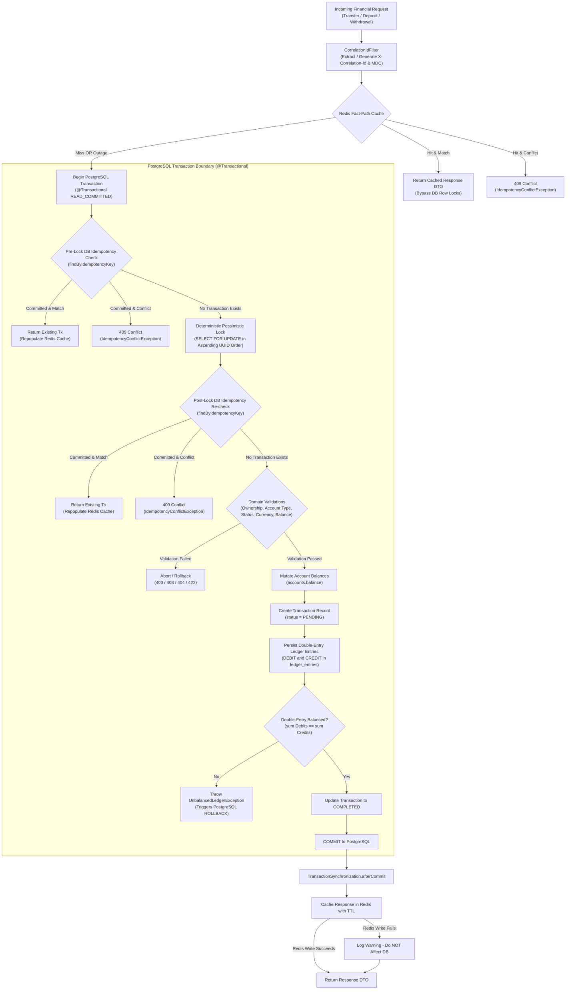

# Financial Ledger Engine — Failure Handling & Reliability

## 1. Architectural Philosophy: Source of Truth vs. Optimization

In the **Financial Ledger Engine**, the architectural boundary between durability and performance is strictly separated:

- **PostgreSQL is the Authoritative Financial Source of Truth**: All account balances, transaction states, immutable double-entry ledger entries, foreign keys, and idempotency guarantees originate from and are finalized in PostgreSQL under ACID transaction isolation.
- **Redis is an Auxiliary Performance Optimization**: Redis serves solely as an idempotency fast-path cache to bypass database row locks and query overhead for repeated requests. Redis is **never** an authoritative financial store, does not hold durable state, and is not part of a two-phase commit lifecycle. All Redis interactions fail open gracefully to PostgreSQL.



---

## 2. PostgreSQL Transaction Boundary & Rollback Semantics

All financial mutations across transfers (`TransferService`), deposits (`DepositService`), and withdrawals (`WithdrawalService`) execute under Spring's `@Transactional` boundary with PostgreSQL default isolation (`READ_COMMITTED`).

### 2.1 Atomic Mutation Scope
Within each transaction, the following state changes occur atomically:
1. **Account Balances**: Source account is debited and destination account is credited in `accounts.balance`.
2. **Transaction Lifecycle**: A `transactions` record is initialized in `PENDING` status and transitioned to `COMPLETED` upon verification.
3. **Double-Entry Ledger Entries**: Balanced immutable `DEBIT` and `CREDIT` records are persisted in `ledger_entries`.

### 2.2 All-or-Nothing Rollback
If any exception occurs during processing—including business validation failures, database connectivity loss, deadlock aborts, disk errors, or double-entry imbalance:
- Spring and PostgreSQL trigger an immediate transaction `ROLLBACK`.
- **Zero Partial State**: Account balances revert to their exact pre-transaction values.
- **Zero Orphan Records**: Any generated `transactions` or `ledger_entries` records are completely discarded.
- Because `afterCommit()` is skipped on rollback, **no record is placed in Redis**, leaving the system clean for subsequent retries.

### 2.3 Multi-Layered Database Integrity (Defense-in-Depth)
In addition to application-layer validations, the database enforces structural integrity constraints that guarantee correctness even if application checks are bypassed:

| Layer | Constraint / Mechanism | Database Object | Enforcement & Behavior |
|---|---|---|---|
| **Database Trigger** | `trg_ledger_entries_immutable` | `ledger_entries` | Intercepts all `UPDATE` and `DELETE` attempts; raises exception: *"Ledger entries are immutable"*. |
| **Check Constraint** | `accounts_balance_non_negative_check` | `accounts` | `CHECK (balance >= 0.0000)` prevents accounts from dropping below zero at the engine level. |
| **Check Constraint** | `ledger_entries_amount_positive_check` | `ledger_entries` | `CHECK (amount > 0.0000)` guarantees monetary values posted to the ledger are strictly positive. |
| **Check Constraint** | `chk_transaction_currencies` | `transactions`, `ledger_entries` | Enforces currency consistency across transactions and ledger records. |
| **Unique Constraint** | `uk_transactions_idempotency_key` | `transactions` | Guarantees that at most one transaction can ever commit per idempotency key across all concurrent threads. |
| **Foreign Keys** | `fk_ledger_entries_transaction_id`, `fk_ledger_entries_account_id` | `ledger_entries` | `ON DELETE RESTRICT` guarantees parent entities cannot be removed while referenced by ledger entries. |

---

## 3. Redis Failure Modes & Resilience

### 3.1 Redis Unavailable Before Execution (Fast-Path Read Outage)
When Redis is down, unreachable, or encounters network timeouts during the initial idempotency check:
- `IdempotencyCacheService.get(key, Class<T>)` catches all Redis exceptions (`RedisConnectionFailureException`, `QueryTimeoutException`, etc.) and returns `Optional.empty()`.
- The calling service (`TransferService`, `DepositService`, or `WithdrawalService`) also wraps the lookup in a defensive `try/catch` block and logs a warning at `WARN` level.
- **Fail-Open Policy**: The request seamlessly falls through to PostgreSQL without failing the user request.
- The PostgreSQL transaction begins, performs the pre-lock idempotency check in `transactions`, and executes with full durability.
- Financial correctness is maintained with zero client-visible interruption.

### 3.2 Redis Failure After Database Commit (Post-Commit Write Outage)
To prevent auxiliary cache operations from compromising financial durability:
- Redis writes are registered via `TransactionSynchronizationManager.registerSynchronization` inside `afterCommit()`.
- The Redis `set()` operation executes **only after** PostgreSQL has committed the transaction to durable storage.
- If Redis fails during this write (e.g., timeout, network partition, out-of-memory eviction):
  - The failure is caught and logged at `WARN` level.
  - **Redis cannot roll back or invalidate committed financial state.** The PostgreSQL commit is final.
  - The client receives the successful response DTO.

### 3.3 Cache Expiration & Lazy Repopulation
- Redis keys are stored with a configurable TTL (`ledger.idempotency.ttl-seconds`, default 86,400 seconds / 24 hours).
- **Cache Miss on Expiration**: When a client retries after TTL expiration, the Redis fast-path misses and falls through to PostgreSQL.
- **Authoritative Resolution**: PostgreSQL locates the committed transaction record by `idempotency_key`, validates parameters and account ownership, and returns the committed result.
- **Lazy Repopulation**: On a successful PostgreSQL lookup, the service lazily repopulates Redis with the cached response so subsequent retries regain fast-path performance.

---

## 4. Idempotency Under Failure & Retries

### 4.1 Failed / Rolled-Back Transactions
If an initial transaction attempt fails (due to transient database errors, simulated network blips, or insufficient balance):
1. The PostgreSQL transaction rolls back; no record is persisted in `transactions` or `ledger_entries`.
2. Because `afterCommit()` is never triggered for a rolled-back transaction, **no record is placed in Redis**.
3. **Safe Retry Semantics**: When the client retries with the exact same idempotency key after resolving the transient failure:
   - Redis encounters a cache miss.
   - PostgreSQL finds no existing transaction record.
   - The transaction executes fresh.
   - Once committed, exactly one financial mutation occurs.

### 4.2 Concurrent Duplicate Retries (Race Conditions)

#### Scenario A: Concurrent Retries on the Same Accounts
When multiple concurrent threads submit requests with the same idempotency key and identical parameters for the same accounts:
1. **Redis Available**: The first thread executes; subsequent threads hit the Redis fast-path cache and return immediately without contending for database row locks.
2. **Redis Unavailable (or Cache Miss)**: All threads fall through to PostgreSQL.
   - The threads contend for deterministic pessimistic row locks on the accounts.
   - The winning thread acquires the locks, confirms no transaction exists via the post-lock idempotency check, executes the transfer, saves the transaction, and commits.
   - The waiting threads acquire the locks sequentially, execute the **post-lock idempotency re-check** (`transactionRepository.findByIdempotencyKey(key)`), detect that the transaction was committed by the winning thread, repopulate Redis, and return the committed transaction without re-applying balance mutations.

#### Scenario B: Concurrent Retries on Different Accounts
If malicious or buggy clients submit duplicate idempotency keys concurrently across different accounts:
1. The threads acquire locks on different accounts and do not block each other at the row-lock stage.
2. Both threads proceed to insert a new `Transaction` record with the identical `idempotency_key`.
3. PostgreSQL's unique constraint `uk_transactions_idempotency_key` rejects the second insert, throwing `DataIntegrityViolationException`.
4. `GlobalExceptionHandler` intercepts the constraint violation, rolls back the second transaction, and responds with `HTTP 409 Conflict`.

### 4.3 Idempotency Conflict Detection
If a retry arrives with an existing idempotency key but conflicting parameters:
- **Checked Parameters**:
  - **Transfers**: `sourceAccountId`, `destinationAccountId`, `amount` (scaled to 4 decimal places), `currency`, and `description`.
  - **Deposits**: `destinationAccountId`, `amount`, `currency`, `transactionType == DEPOSIT`, and `description`.
  - **Withdrawals**: `sourceAccountId`, `amount`, `currency`, `transactionType == WITHDRAWAL`, and `description`.
- **Enforcement**:
  - Detected on the Redis fast-path before acquiring database locks.
  - Detected during the pre-lock PostgreSQL check before acquiring row locks.
  - Detected during the post-lock PostgreSQL check before mutating balances.
- In all cases, the system rejects the request with `IdempotencyConflictException` (`HTTP 409 Conflict`), leaving balances and ledger entries completely untouched.

---

## 5. Concurrency Guarantees & Deadlock Prevention

### 5.1 Deterministic Lock Ordering
Circular-wait deadlocks between opposing concurrent transfers (e.g., concurrent $A \to B$ and $B \to A$) are prevented by sorting account UUIDs and acquiring pessimistic write locks (`SELECT ... FOR UPDATE`) in ascending lexicographical order:

$$\text{firstLockId} = \min(\text{accountA}, \text{accountB}), \quad \text{secondLockId} = \max(\text{accountA}, \text{accountB})$$

```java
UUID firstLockId = sourceId.compareTo(destinationId) < 0 ? sourceId : destinationId;
UUID secondLockId = sourceId.compareTo(destinationId) < 0 ? destinationId : sourceId;

Account firstAccount = accountRepository.findByIdForUpdate(firstLockId)
        .orElseThrow(() -> new AccountNotFoundException("Account not found: " + firstLockId));
Account secondAccount = accountRepository.findByIdForUpdate(secondLockId)
        .orElseThrow(() -> new AccountNotFoundException("Account not found: " + secondLockId));
```

This deterministic locking order is applied across:
- **Transfers**: Between source and destination `USER_CHECKING` accounts.
- **Deposits & Withdrawals**: Between the user's `USER_CHECKING` account and the system clearing account (`SYSTEM_CLEARING_ACCOUNT_ID = 00000000-0000-0000-0000-000000000001`).

### 5.2 Double-Entry Invariant Verification
Before updating transaction status to `COMPLETED` and committing, the engine explicitly asserts:

$$\sum \text{Debits} = \sum \text{Credits}$$

Any arithmetic deviation raises `UnbalancedLedgerException` (`HTTP 500 Internal Server Error`), rolling back the entire database transaction.

### 5.3 Connection Pool Sizing & Backpressure
Under heavy concurrent load, database connection exhaustion can cause cascading latency spikes:
- **HikariCP Pool Configuration**: Configured via `HIKARI_MAX_POOL_SIZE` (default: 30) and `HIKARI_CONNECTION_TIMEOUT` (default: 30,000 ms).
- **Backpressure**: Prevents thread starvation and bounds the number of concurrent active PostgreSQL transactions.

---

## 6. Financial Integrity Verification: Post-Failure Reconciliation

Following any simulated failure, retry burst, or outage, the **Reconciliation Subsystem** (`com.parth.ledger.reconciliation`) verifies account integrity:

### 6.1 Reconciliation Formula
$$\text{Ledger Balance} = \sum_{\text{entry} \in \text{CREDIT}} \text{amount} - \sum_{\text{entry} \in \text{DEBIT}} \text{amount}$$

$$\text{Difference} = \text{Snapshot Balance} - \text{Ledger Balance}$$

$$\text{Status} = \begin{cases} \text{CONSISTENT}, & \text{if } \text{Difference} = 0.0000 \\ \text{DISCREPANCY}, & \text{if } \text{Difference} \neq 0.0000 \end{cases}$$

### 6.2 Analytical Read-Only Guarantee
A foundational principle of the engine is that **reconciliation never silently overwrites account balances**:
1. Automatic mutations would destroy forensic audit trails needed for root-cause analysis.
2. In double-entry bookkeeping, any balance adjustment must be backed by an explicit, auditable **compensating transaction**.
3. Reconciliation flags discrepancies for operational investigation while leaving ledger data immutable.

---

## 7. Standardized Error Handling & Observability

### 7.1 HTTP Status Code Mapping
The centralized `GlobalExceptionHandler` converts domain exceptions into standardized HTTP error responses:

| HTTP Status | Exception Class | Trigger Condition |
|---|---|---|
| **`400 Bad Request`** | `InvalidAmountException` | Non-positive amount or scale > 4 decimal places. |
| | `CurrencyMismatchException` | Request currency differs from account currency. |
| | `SameAccountTransferException` | Source and destination accounts are identical. |
| | `InvalidAccountTypeException` | Operation attempted on invalid account type (e.g. retail transfer on system clearing account). |
| | `MissingRequestHeaderException` | Missing required `Idempotency-Key` header. |
| | `HttpMessageNotReadableException` | Malformed or invalid JSON payload. |
| **`401 Unauthorized`** | `AuthenticationCredentialsNotFoundException` | Unauthenticated request attempting access to protected endpoints. |
| **`403 Forbidden`** | `AccountOwnershipException` | Authenticated user does not own the debited source account. |
| | `UserNotFoundException` | Authenticated principal not registered in database. |
| **`404 Not Found`** | `AccountNotFoundException` | Account UUID does not exist. |
| **`409 Conflict`** | `IdempotencyConflictException` | Idempotency key reused with mismatched request parameters. |
| | `DataIntegrityViolationException` | Race condition violating `uk_transactions_idempotency_key`. |
| **`422 Unprocessable Content`** | `InsufficientBalanceException` | Account balance is less than required transfer/withdrawal amount. |
| | `AccountFrozenException` | Operation attempted on an account in `FROZEN` status. |
| | `AccountClosedException` | Operation attempted on an account in `CLOSED` status. |
| | `AccountStatusException` | Account is not in `ACTIVE` status. |
| **`500 Internal Server Error`** | `UnbalancedLedgerException` | Double-entry debits do not equal credits before commit. |

### 7.2 Structured Error Response Schema
All error responses adhere to the standard `ErrorResponse` DTO:

```json
{
  "timestamp": "2026-09-24T18:30:00.123456Z",
  "status": 409,
  "error": "Conflict",
  "message": "Idempotency key 'tx-uuid-123' was already used for a transfer with different parameters",
  "path": "/api/v1/transfers",
  "details": null
}
```

### 7.3 End-to-End Correlation Tracking
- `CorrelationIdFilter` inspects incoming HTTP requests for `X-Request-Id` or `X-Correlation-Id`.
- If absent, it generates a random UUID.
- The ID is stored in SLF4J MDC under `correlationId` and attached to the response headers `X-Request-Id` and `X-Correlation-Id`.
- All log lines include `[correlationId=...]` for tracing failure cascades across Redis, PostgreSQL, and security filters.

---

## 8. Failure & Reliability Test Verification Matrix

The failure handling and reliability mechanisms are verified by automated integration tests:

| Test Suite | Test Scenario | Verified Guarantee |
|---|---|---|
| `TransferRollbackIntegrationTest` | **Scenario C**: PostgreSQL failure on `Transaction` save | Transaction rolls back completely; balances intact; zero orphan records; reconciliation `CONSISTENT`. |
| `TransferRollbackIntegrationTest` | **Scenario D**: PostgreSQL failure on `LedgerEntry` save | Balances mutated in memory revert; pending transaction discarded; reconciliation `CONSISTENT`. |
| `TransferRollbackIntegrationTest` | **Scenario E**: Idempotent retry after initial failure | First attempt fails and leaves no database trace; second attempt with identical key succeeds cleanly with single financial effect. |
| `TransferRedisIdempotencyIntegrationTest` | **Fast-Path Population** | Successful transfer populates Redis with correct TTL and serialized DTO upon commit. |
| `TransferRedisIdempotencyIntegrationTest` | **Fast-Path Lock Bypass** | Duplicate request served from Redis without invoking `findByIdForUpdate` (zero row locks acquired). |
| `TransferRedisIdempotencyIntegrationTest` | **Redis Conflict Detection** | Parameter mismatch detected in Redis fast-path; immediately returns `409 Conflict`. |
| `TransferRedisIdempotencyIntegrationTest` | **Redis TTL Expiration** | Expired Redis key falls back to PostgreSQL, returns committed result, and lazily repopulates Redis. |
| `TransferRedisIdempotencyIntegrationTest` | **Redis Read Outage** | Simulated Redis connection exception fails open; transaction succeeds via PostgreSQL. |
| `TransferRedisIdempotencyIntegrationTest` | **Redis Write Outage** | Simulated Redis failure during post-commit write logs warning; PostgreSQL commit remains durable. |
| `TransferConcurrencyIntegrationTest` | **Opposing Transfers ($A \to B$ vs $B \to A$)** | 40 concurrent opposing transfers complete without circular-wait deadlocks. |
| `TransferConcurrencyIntegrationTest` | **Concurrent Duplicate Retries** | Multiple threads submitting identical key execute exactly once; zero duplicate debits. |
| `LedgerImmutabilityIntegrationTest` | **Trigger Immutability Enforcement** | Direct SQL `UPDATE` and `DELETE` queries on `ledger_entries` are blocked by database trigger. |
| `TransactionCurrencyIntegrityIntegrationTest` | **Currency Invariant Enforcement** | Database check constraint blocks mismatched currencies between transactions and ledger entries. |
| `AccountLifecycleIntegrationTest` | **Lifecycle Status Checks** | Transfers, deposits, and withdrawals on `FROZEN` or `CLOSED` accounts fail with `422 Unprocessable Content`. |

---

## 9. Limitations & Non-Guarantees

To maintain engineering precision, the following limitations and non-guarantees are explicitly noted:

1. **Network-Level Ambiguity**: If a network partition severs communication between the client and API after PostgreSQL has committed but before the HTTP response reaches the client, the client experiences a connection timeout. The transaction has committed. The client **must** retry using the same `Idempotency-Key` to safely learn the outcome without creating a duplicate transfer.
2. **Distributed Deadlock Scope**: Deterministic lock ordering eliminates classic circular-wait patterns within this single application database. In distributed architectures involving multiple database shards or external payment gateways, distributed deadlock freedom requires two-phase locking protocols or saga orchestrators.
3. **No "Exactly-Once" Network Transmission**: "Exactly-once" delivery over an unreliable network is theoretically impossible. The engine guarantees **idempotent financial processing** (a single financial effect under arbitrary client retries), not exactly-once network transmission.
4. **Redis Cache Freshness**: Redis entries are subject to TTL expiration and eviction policies. A cache miss after expiration does not compromise correctness because PostgreSQL remains the durable, authoritative source of truth.
