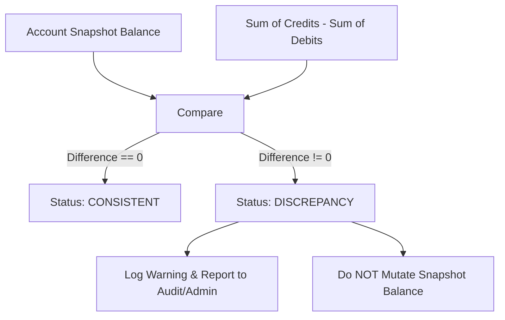

# Financial Ledger Engine — Reconciliation & Financial Integrity

## 1. Overview

In the **Financial Ledger Engine**, PostgreSQL serves as the authoritative financial source of truth. The system enforces strict double-entry bookkeeping, where every monetary movement is represented as balanced debit and credit entries.

Financial integrity relies on the continuous agreement between two independent views of account state:
1. **Account Balance Snapshot (`accounts.balance`)**: The current point-in-time balance materialized directly on the account record, optimized for fast balance checks and pessimistic row-level locking during transfers.
2. **Ledger-Derived Balance**: The historical balance computed by aggregating all immutable double-entry records (`ledger_entries`) posted to that account since inception.

The **Reconciliation Subsystem** (`com.parth.ledger.reconciliation`) performs periodic and on-demand audits comparing these two views to detect any balance drift, unauthorized direct database mutations, software bugs, or partial transaction failures.

---

## 2. Core Concepts

### Account Snapshot Balance
The snapshot balance represents the balance stored in `accounts.balance` (`NUMERIC(19,4)`). During transfer execution, this column is updated within the database transaction while holding a pessimistic row lock (`SELECT ... FOR UPDATE`). It allows high-throughput transfers without having to sum all historical ledger entries on every transfer validation.

### Ledger-Derived Balance
Ledger entries (`ledger_entries`) are append-only, immutable financial facts. Each completed transfer produces:
- A `DEBIT` entry against the source account.
- A `CREDIT` entry against the destination account.

The ledger-derived balance is computed from the fundamental accounting identity:

$$\text{Ledger Balance} = \text{Initial Balance} + \sum \text{Credits} - \sum \text{Debits}$$

### Reconciliation Formula & Schema Model Assumptions
Under the current schema model (`V1__create_core_ledger_schema.sql`), accounts are defined with `balance NUMERIC(19, 4) NOT NULL DEFAULT 0.0000`, and there is no explicit `initial_balance` column.

In strict double-entry accounting, all money originates from ledger-recorded transactions. Hence, the baseline initial balance for any account is:

$$\text{Initial Balance} = 0.0000$$

Therefore, the implemented reconciliation calculation is:

$$\text{Ledger Balance} = \sum_{\text{entry} \in \text{CREDIT}} \text{amount} - \sum_{\text{entry} \in \text{DEBIT}} \text{amount}$$

$$\text{Difference} = \text{Snapshot Balance} - \text{Ledger Balance}$$

$$\text{Status} = \begin{cases} \text{CONSISTENT}, & \text{if } \text{Difference} = 0.0000 \\ \text{DISCREPANCY}, & \text{if } \text{Difference} \neq 0.0000 \end{cases}$$

All arithmetic is executed using Java `BigDecimal` with 4 decimal places (`RoundingMode.HALF_UP`) matching PostgreSQL `NUMERIC(19,4)`. Floating-point arithmetic is strictly prohibited.

---

## 3. Discrepancy Semantics

A status of `DISCREPANCY` indicates a break in financial integrity:

- **Positive Difference ($\text{Difference} > 0$)**: The snapshot balance is higher than what ledger entries support. This signifies unbacked funds, missing debit entries, or an unauthorized direct database credit/update.
- **Negative Difference ($\text{Difference} < 0$)**: The snapshot balance is lower than what ledger entries support. This signifies missing credit entries or an unauthorized debit.



---

## 4. Why Reconciliation Detects Rather Than Repairs

A foundational principle of financial ledger architecture is that **reconciliation must never silently "fix" or overwrite an account balance**:

1. **Auditability & Evidentiary Integrity**: Silently altering a snapshot balance overwrites evidence of an anomaly, making post-incident forensic root-cause analysis impossible.
2. **Double-Entry Invariant**: You cannot adjust an account balance in isolation without violating the ledger balance invariant. In double-entry bookkeeping, any balance adjustment must be backed by an explicit, attributed, and authorized **compensating transaction** between accounts.
3. **Data Loss Prevention**: An automated script cannot deduce *why* a discrepancy occurred (e.g., an in-flight uncommitted transaction, a failed network call, a database recovery anomaly, or fraud). Automated repair might cement fraudulent or corrupted state.

Consequently, reconciliation is purely **read-only and analytical**. Discrepancies are flagged for investigation and resolution through formal operational procedures.

---

## 5. Security & Multi-Tenancy

Reconciliation endpoints adhere strictly to the project's security and authorization model:
- **Authentication**: All endpoints require an authenticated session (`SecurityConfig` protects `/api/**`). Unauthenticated calls return `HTTP 401 Unauthorized`.
- **Account Ownership Enforcement**: Users may only reconcile accounts they own (`account.user_id == authenticatedUser.id`). Attempting to inspect another user's account reconciliation returns `HTTP 403 Forbidden`.
- **Collection Scope**: Multi-account reconciliation (`GET /api/v1/reconciliation/accounts`) automatically scopes the query to the authenticated caller's accounts, preventing cross-tenant leakage.

---

## 6. API Reference & Examples

### 1. Single Account Reconciliation

**Request**:
```http
GET /api/v1/reconciliation/accounts/e71db137-ba49-4b5f-9b02-18149722bc61 HTTP/1.1
Host: localhost:8085
Cookie: JSESSIONID=...
```

**Consistent Response (`200 OK`)**:
```json
{
  "accountId": "e71db137-ba49-4b5f-9b02-18149722bc61",
  "snapshotBalance": 350.0000,
  "ledgerBalance": 350.0000,
  "difference": 0.0000,
  "status": "CONSISTENT",
  "totalCredits": 500.0000,
  "totalDebits": 150.0000,
  "reconciledAt": "2026-09-23T08:00:00Z"
}
```

**Discrepancy Response (`200 OK`)**:
```json
{
  "accountId": "e71db137-ba49-4b5f-9b02-18149722bc61",
  "snapshotBalance": 400.0000,
  "ledgerBalance": 350.0000,
  "difference": 50.0000,
  "status": "DISCREPANCY",
  "totalCredits": 500.0000,
  "totalDebits": 150.0000,
  "reconciledAt": "2026-09-23T08:00:00Z"
}
```

### 2. Multi-Account Reconciliation (All Caller Accounts)

**Request**:
```http
GET /api/v1/reconciliation/accounts HTTP/1.1
Host: localhost:8085
Cookie: JSESSIONID=...
```

**Response (`200 OK`)**:
```json
{
  "totalAccountsChecked": 2,
  "consistentAccounts": 2,
  "discrepancyCount": 0,
  "reconciliationResults": [
    {
      "accountId": "e71db137-ba49-4b5f-9b02-18149722bc61",
      "snapshotBalance": 350.0000,
      "ledgerBalance": 350.0000,
      "difference": 0.0000,
      "status": "CONSISTENT",
      "totalCredits": 500.0000,
      "totalDebits": 150.0000,
      "reconciledAt": "2026-09-23T08:00:00Z"
    },
    {
      "accountId": "f82ec248-cb50-5c60-ac13-2925a833cd72",
      "snapshotBalance": 150.0000,
      "ledgerBalance": 150.0000,
      "difference": 0.0000,
      "status": "CONSISTENT",
      "totalCredits": 150.0000,
      "totalDebits": 0.0000,
      "reconciledAt": "2026-09-23T08:00:00Z"
    }
  ],
  "reconciledAt": "2026-09-23T08:00:00Z"
}
```
